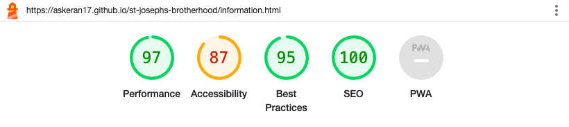

# The Brotherhood of Saint Joseph

The Brotherhood of Saint Joseph is site which is dedicated to the saint of our days and his disciples. 

On this site a person will also find the answer to the question of how to deal with bad thoughts.

On Mount Athos in the first half of the 20th century, a group of people rallied around one monk, united by a common idea: by following a special system of mystical spiritual exercises, to purify one’s thoughts and, having achieved spiritual perfection, to know God.

Elder Joseph, who is also called the Caveman, Hesychast and Silencer, took upon himself the great work of leading these people, with the help of sacred silence, to the gates of the Kingdom of Heaven, contained within each person (Luke 17:21).

You can check out the website [here](https://askeran17.github.io/st-josephs-brotherhood/)!

## Adaptability on a variety of screen sizes

## Design
I used program "Balsamiq Wireframes" to draw a page layout.

## Features

### Existing Features

__Header__

- The header has an adaptive navigation bar on the right. There are three links there: home, advice from the elders and information. The visitor can easily navigate through these links thanks to the responsive bar. Also, in the mobile or medium screen extension version, there will be a “hamburger” icon on the right side of the adaptive panel, which means that the same links are hidden behind it. This is very convenient and allows you to take up less page space.

- On the left side of header there is a logo that can be clicked and it will return the visitor to the main page.

__Main content__

- On the first page the visitor can see a large image of the holy elder Joseph and his quote on top of the picture itself.

- The following is a biography of St. Joseph and his disciples. Photos of students are beautifully circled and placed on the left side of the text. For the circle I used border-radius property and others which you can see more in the style.css.

__Footer__

- In the footer I have placed a link to YouTube, where the visitor can watch a film about St. Joseph. I did not insert a link to the video inside the main content, but decided to place it in the footer, since it is convenient, does not take up much space and just looks beautiful with the YouTube button. The link opens in a separate tab and the visitor is taken to YouTube, while the site remains open. It is very comfortable. And under YouTube button I placed copyright.

__Second page__

- On the second page I posted a general photo of the Brotherhood of St. Joseph, and below are the elders’ advice on spiritual life.

__Last page__

- On the last page I posted information for pilgrims to the holy Mount Athos, which office they can contact before going there. He also indicated the address of the bureau itself and its opening hours.

- Google map is also available on the last page in footer, it is adaptive and works correctly on all devices. Using the map, a person will know where the holy Mount Athos is located.

## Testing

Throughout the development of the site, I used Google's developer tools to identify and fix any problems along the way.

If something didn't work correctly, I also used Google's developer tools to tweak and fix the problem.

I've thoroughly tested each page using Google Chrome's developer tools to ensure each page is responsive on a variety of screen sizes and devices.

### Lighthouse

I used Lighthouse within the Chrome Developer Tools to test the performance, accessibility, best practices and SEO of the website.

### Desktop Results

All pages showed good scores.

### Mobile Results

All pages showed good scores.

### Manual Testing

__Visitors__

| Goal | Has the goal been achieved? |
| :--- | :--- |
| I want to find advice from spiritual saints on how to deal with bad thoughts. | This site will introduce the visitor to holy people who lived just recently; these people will help a person with their advice on how to overcome bad thoughts.
| The site must be responsive. | The site is adaptive and works correctly on all devices.

### Validator Testing 

- HTML
  - No errors were returned when passing through the official [W3C validator](https://validator.w3.org/nu/?doc=https%3A%2F%2Faskeran17.github.io%2Fst-josephs-brotherhood%2F)
- CSS
  - No errors were found when passing through the official [(Jigsaw) validator](http://jigsaw.w3.org/css-validator/validator?lang=en&profile=css3svg&uri=https%3A%2F%2Faskeran17.github.io%2Fst-josephs-brotherhood%2F&usermedium=all&vextwarning=&warning=1)

### Unfixed Bugs

On the main page in the section biography of the disciples of St. Joseph, I wanted to enlarge the photographs of the elders in an adaptive design with an extension of 768 pixels and higher. But every time I enlarged the pictures, the text of their biography went somewhere to the side and I didn’t know how to solve this problem. Therefore, the pictures remained in a smaller size than I wanted.

  ## Technologies Used

### Workspace

I did all the work in Codeanywhere, and at the same time I used VSCode as a draft and sometimes wrote the code there, and then copied it from there and pasted it into Codeanywhere.

### Languages Used

HTML, CSS, Javascript

### Frameworks, Libraries & Programs Used

* [Github](https://github.com/) - To save and store the files for the website.

* [Google Fonts](https://fonts.google.com/) - To import the fonts used on the website.

* [Google Developer Tools](https://developers.google.com/web/tools) - To troubleshoot and test features, solve issues with responsiveness and styling.

* [IloveImg](https://www.iloveimg.com/) To resize images.

* [Convertio](https://convertio.co/) To convert images to webp format.

* [Favicon.io](https://favicon.io/) To create favicon.

* [Balsamiq](https://balsamiq.com/) - Used to create wireframes.

* [Am I Responsive?](http://ami.responsivedesign.is/) To show the website image on a range of devices.

## Deployment

The site was deployed to GitHub - [The brotherhood of Saint Joseph](https://askeran17.github.io/st-josephs-brotherhood/)

The steps to deploy are as follows:

1. Login (or signup) to Github.
2. Go to the repository for this project, [st-josephs-brotherhood](https://github.com/Askeran17/st-josephs-brotherhood.git)
3. Click the settings button.
4. Select pages in the left hand navigation menu.
5. From the source dropdown select main branch and press save.
6. The site has now been deployed.

## Credits 

I was inspired by the Love Running project at the Code Institute and took the code from there.

### Content 

- Since there is very little information in the English-language segment about Elder Joseph and his brotherhood, I took information from Russian-language sites (azbyka.ru and pravoslavie.ru). And I translated it into English using Google-translate; I know Russian well and therefore I didn’t just copy and paste, but checked and corrected the places in the translation that were inaccurate. I used ready-made text from Russian sites, because the biography, as well as the advice of the elders, needed to be conveyed exactly in the form in which they exist. Therefore, I did not invent these texts myself, but had to convey them to the reader exactly in the form in which they exist.

- The icons in the footer and in the second page were taken from [Font Awesome](https://fontawesome.com/)

### Media

- The images in site I took from open source, i.e. google.

